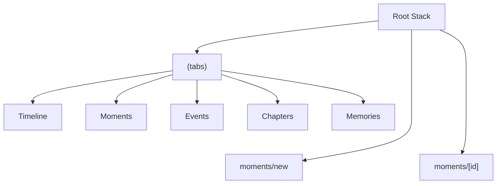
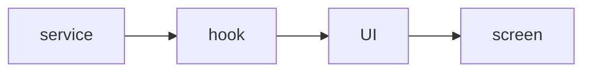
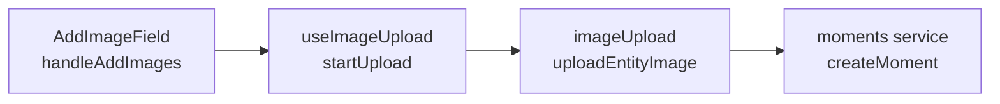

# Diagrams

## Routing And Navigation




## Data Model

```mermaid
erDiagram
  GROUPS {
    uuid id
    text name
    string ...
  }

  MOMENTS {
    uuid id
    uuid group_id
    text title
    string ...
  }

  PHOTOS {
    uuid id
    uuid group_id
    text storage_path
    string ...
  }

  GROUPS ||--o{ MOMENTS : scopes
  GROUPS ||--o{ PHOTOS : scopes
```


## App Layers




## Moment Image Flow




