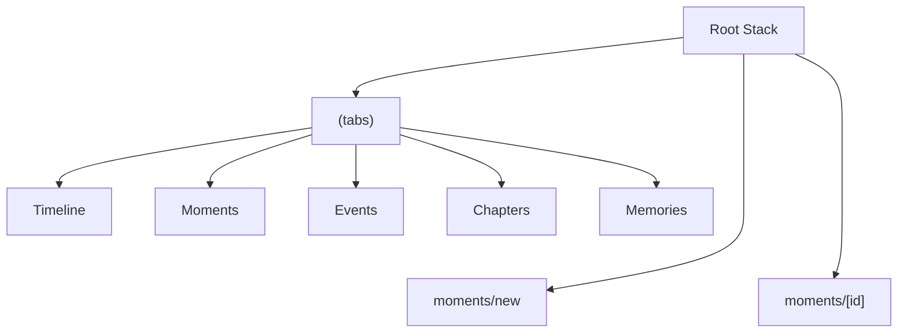
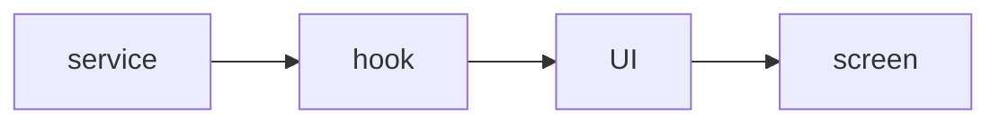

# CPAT Exam Notes: 5-minute screencast plan

## Exact Exam Frame

The exam is a **24-hour home assignment**:

- Start: Monday, April 27, 2026 at 12:00
- Deadline: Tuesday, April 28, 2026 at 12:00
- Delivery: individual screencast video, maximum **5 minutes**
- Upload: Wiseflow, preferably `.mp4`

The video is assessed on academic communication:

- correct terminology
- technical overview
- understanding of the implementation
- clear and coherent explanation

Visual polish, effects, transitions and editing style are not weighted.

The video must cover these five areas:

1. App in action
2. Native mobile experience
3. Routing and navigation
4. Implementation in code
5. Data and backend

## Main Angle

Use **Moments with image upload inside a selected Space** as the main example.

This is still the strongest feature because it hits every exam requirement:

- **App in action:** create a Moment in a Space and attach a photo.
- **Native mobile experience:** Expo ImagePicker, safe areas, modal flow, haptics and image gestures.
- **Routing/navigation:** tabs for main sections, stack routes for modal create screens and detail screens.
- **Implementation:** form state, upload state, React Query mutations, services and components.
- **Data/backend:** Supabase Auth, Database, Storage, `group_id` scoping and signed image URLs.

Keep the overall app framing simple:

> Memoir is a React Native memory app for saving personal or shared memories in Spaces. It has Timeline, Moments, Events, Chapters and Memories, but in this video I focus on Moments because it shows the complete flow from mobile UI to Supabase.

Avoid using Chapters as the main feature, because it is less clearly your strongest individual implementation angle. Events can be a backup, but Moments has the cleaner image-upload story.

## Files To Have Ready

Keep the visible code set small. Open these files first:

1. `app/_layout.tsx`
2. `app/(tabs)/_layout.tsx`
3. `components/MomentForm.tsx`
4. `components/ui/AddImageField.tsx`
5. `hooks/useImageUpload.ts`
6. `services/imageUpload.ts`
7. `services/moments.ts`

Mention only if needed:

- `app/(tabs)/moments/index.tsx` - proves `router.push('/moments/new')` and detail navigation
- `components/ui/FullscreenImageViewer.tsx` - contains the swipe-to-dismiss and zoom implementation
- `lib/images.ts` - contains the private bucket and signed URL helper

## Opdaterede Tale-kort

### Tale-kort 1: Intro og kerneapp

Jamen, velkommen til Memoir, som er en React Native-app bygget med Expo. Appen handler om at gemme personlige eller delte minder i det, vi kalder Spaces eller groups.

Et Space kan være personligt eller delt, og indholdet bliver scoped til det valgte Space. Så brugeren arbejder hele tiden i en bestemt kontekst.

Hvis vi kigger på appen helt overordnet, har vi flere typer indhold: Timeline, hvor tingene samles, og så Moments, Events, Chapters og Memories.

I den her gennemgang fokuserer jeg på Moments, fordi det er et godt eksempel til at vise både appens funktionalitet, native mobile experience, routing, code implementation og backend.

Inden jeg viser selve Moment-flowet, starter jeg med navigationen, fordi den forklarer, hvordan brugeren kommer fra appens hovedområder og ind i create- og detail-skærmene.

### Tale-kort 2: Routing og navigation

Routing er bygget med Expo Router, hvor filstrukturen i `app`-mappen definerer appens routes.

I vores root layout bruger vi Stack navigation til de overordnede flows.

Inde i `(tabs)` ligger de faste hovedsektioner: Timeline, Moments, Events, Chapters og Memories.

`moments/new` og `moments/[id]` ligger uden for `(tabs)` og ejes derfor af Root Stack.

Det er et bevidst valg, fordi brugeren ikke skal føle, at create og detail bare er endnu en tab-side.

De kan stadig åbnes fra Moments, men vises uden bottom tab bar og fælles tab header. Så tabs bruges til de faste områder, mens create og detail får et mere fokuseret native-style flow.



Når navigationen er på plads, giver det mening at kigge på data-modellen bag flowet. For når brugeren opretter et Moment, er det ikke kun en skærm der åbner; der bliver også skrevet data til Supabase.

### Tale-kort 3: Data og backend

Data-flowet er delt op i layers. Screen binder navigation sammen, UI components håndterer forms og billeder, hooks styrer state og mutations, og services taler med Supabase.

Supabase bruges til Auth, Database og Storage. Den aktive Space bestemmer `group_id`, så Moments og billeder bliver scoped til den rigtige Space.

Billedfilen ligger i Storage. Databasen gemmer Momentet og photo metadata, blandt andet `storage_path`, som peger på filen.

```mermaid
erDiagram
  GROUPS {
    uuid id
    text name
    string ...
  }

  MOMENTS {
    uuid id
    uuid group_id
    text title
    string ...
  }

  PHOTOS {
    uuid id
    uuid group_id
    text storage_path
    string ...
  }

  GROUPS ||--o{ MOMENTS : scopes
  GROUPS ||--o{ PHOTOS : scopes
```


Pointen er, at UI'et ikke behøver kende detaljerne om Supabase. Det får data gennem hooks, mens services håndterer backend-logikken.



Med den routing og datamodel på plads kan jeg nu vise samme flow i appen, som brugeren faktisk oplever det.


### Tale-kort 4: Demo af Moments

Nu viser jeg Moment-flowet i appen.

Jeg starter i Moments for den valgte Space, trykker på plus-knappen og kommer til `moments/new`.

Her udfylder jeg type, titel, dato og beskrivelse.

Når jeg vælger et billede, bruger appen Expo ImagePicker. Det betyder, at den åbner systemets egen photo picker, altså en native UI component, i stedet for en klassisk web file input.

Efter billedet er valgt, får brugeren et preview med det samme. Billedet kan også åbnes i en fullscreen viewer med modal presentation, safe-area handling og gestures.

Her kan man bruge swipe-to-dismiss, hvor distance og velocity afgør, om vieweren lukker eller springer tilbage med en animation. Billedvisningen understøtter også pinch-to-zoom og double-tap zoom.

Så i demoen viser jeg både native UI, gestures og animationer, som følger mobilkonventioner.

Når Momentet gemmes, bliver Moment-data gemt i databasen, billedmetadata gemmes i `photos`, og billedfilen ligger i Storage. Bagefter kan vi se Momentet i listen eller åbne det i detail view.

Nu har jeg vist Moment-flowet udefra, som brugeren oplever det.

Nu skifter jeg til koden og viser det samme flow indefra: først håndterer UI'et billedvalg, så styrer en hook upload state, så uploader en service selve filen til Supabase Storage, og til sidst gemmer Moment-servicen database-rækkerne i Supabase.

### Tale-kort 5: Implementering i kode

Kode at vise:

- `components/ui/AddImageField.tsx:162` - `handleAddImages`
- `hooks/useImageUpload.ts:130` - `startUpload`
- `services/imageUpload.ts:78` - `uploadEntityImage`
- `services/moments.ts:262` - `createMoment`

Jeg viser altså samme feature som i demoen, men nu i den tekniske rækkefølge: vælg billede, upload billedfilen, gem Momentet og billedmetadata.

Først viser jeg `handleAddImages` i `AddImageField`. Den tjekker om feltet kan redigeres, åbner Expo ImagePicker, filtrerer dubletter og opdaterer previewet med det samme.

Når previewet er opdateret, kalder componenten upload-callbacket med de nye billeder.

Derefter viser jeg `startUpload` i `useImageUpload`. Den markerer billederne som `uploading`, henter user og Space context og uploader hvert billede. Efter upload bliver hvert billede enten `uploaded` eller `failed`.

Så viser jeg `uploadEntityImage` i `imageUpload` servicen. Det er selve filuploadet: den validerer billedtypen, komprimerer billedet med Expo ImageManipulator, tjekker filstørrelsen og uploader JPEG-filen til Supabase Storage.

Til sidst viser jeg `createMoment` i `services/moments.ts`. Formen kalder denne mutation, når brugeren trykker Save. Her bliver Momentet gemt i `moments`, billedmetadata gemmes i `photos`, og relationen mellem Moment og billeder gemmes i `moment_photos`.

Så den korte opsummering er: UI vælger billeder, hook styrer upload state, Storage-servicen uploader filen, og Moment-servicen gemmer database-rækkerne med de færdige Storage paths.

Det er derfor Moments er mit centrale eksempel: det samler app i aktion, native mobiloplevelse, routing, kodeimplementering og Supabase i ét samlet flow.

## 5-Minute Structure

### 0:00-0:30 - Intro And Core App

Show the app on simulator/device.

Say:

> Memoir is an Expo app for saving personal or shared memories in Spaces. I focus on Moments because it shows the full flow: app UI, routing, native mobile experience, code and Supabase.

### 0:30-1:10 - Routing And Navigation

Show `app/_layout.tsx` and `app/(tabs)/_layout.tsx`.

Say:

> The app uses a protected root Stack, tabs for the main sections, modal screens for creating content, and card-style detail screens.

### 1:10-1:45 - Data And Backend

Show the ERD or Supabase tables briefly.

Say:

> Supabase handles Auth, Database and Storage. A Moment is saved in `moments`, image metadata in `photos`, relations in `moment_photos`, and the actual JPEG file in Storage.

### 1:45-3:15 - Moment Demo And Native Mobile Experience

Show the Moment flow: create Moment, pick photo, preview/fullscreen viewer, save.

Say:

> This shows the app in action and the native parts: Expo ImagePicker, fullscreen modal viewing, gestures, upload to Storage and database save.

### 3:15-5:00 - Implementation In Code

Show the same flow from the code:

- `handleAddImages` in `components/ui/AddImageField.tsx`
- `startUpload` in `hooks/useImageUpload.ts`
- `uploadEntityImage` in `services/imageUpload.ts`
- `createMoment` in `services/moments.ts`

Say:

> The code follows the user flow: pick images, upload image files to Storage, then save the Moment and photo metadata in the database.

## Recording Checklist

Before recording:

- App runs on simulator or device.
- You are signed in.
- A Space is selected.
- A test image is ready in the photo library.
- Demo text is prepared.
- Code tabs are open in the planned order.
- Supabase dashboard is ready only if you want a quick backend visual.
- Notifications are closed.
- Timer is visible or nearby.

During recording:

- Say what you are showing before switching file.
- Keep the demo short.
- Use code to prove the explanation, not to read every line.
- Skip anything that does not support Moments, native UX, routing or Supabase.
- If something minor goes wrong, explain calmly and continue.
- Stop before 5 minutes.

After recording:

- Length is under 5 minutes.
- Audio is understandable.
- Code text is readable.
- The video includes app demo, native UX, routing/navigation, implementation and backend.
- File is exported as `.mp4` or another accepted Wiseflow format.

## If Timing Gets Tight

Keep these four points and cut everything else:

- Expo Router: protected Stack, tabs, modal create screen and detail route.
- Native UX: ImagePicker, image compression, safe areas, haptics and gestures.
- Supabase: `moments`, `photos`, Storage and signed URLs.
- Architecture: screen -> component -> hook -> service.

## Short Version To Memorize

> I chose Moments because it shows the complete mobile data flow in a focused way. The user selects a Space, creates a Moment, picks a photo through Expo's native image picker, the image is compressed and uploaded to Supabase Storage, and metadata is saved in Supabase tables. Expo Router handles tabs, modal create screens and detail screens, while React Query keeps the UI responsive through mutations, optimistic updates and invalidation.
