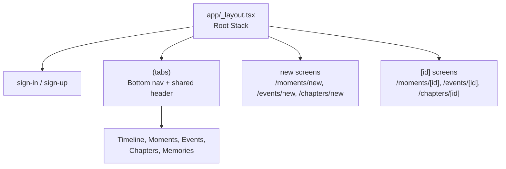
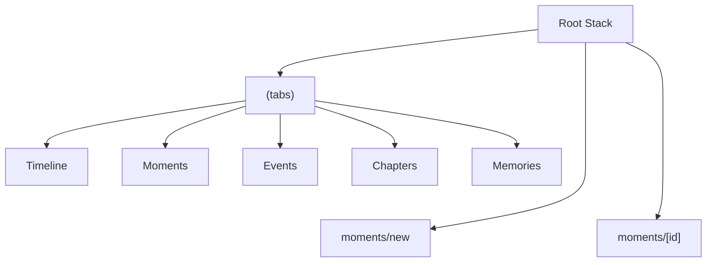
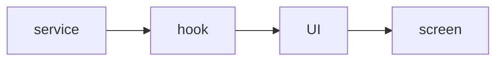

# CPAT Exam Notes: 5-minute screencast plan

## Exact Exam Frame

The exam is a **24-hour home assignment**:

- Start: Monday, April 27, 2026 at 12:00
- Deadline: Tuesday, April 28, 2026 at 12:00
- Delivery: individual screencast video, maximum **5 minutes**
- Upload: Wiseflow, preferably `.mp4`

The video is assessed on academic communication:

- correct terminology
- technical overview
- understanding of the implementation
- clear and coherent explanation

Visual polish, effects, transitions and editing style are not weighted.

The video must cover these five areas:

1. App in action
2. Native mobile experience
3. Routing and navigation
4. Implementation in code
5. Data and backend

## Main Angle

Use **Moments with image upload inside a selected Space** as the main example.

This is still the strongest feature because it hits every exam requirement:

- **App in action:** create a Moment in a Space and attach a photo.
- **Native mobile experience:** Expo ImagePicker, safe areas, modal flow, haptics and image gestures.
- **Routing/navigation:** tabs for main sections, stack routes for modal create screens and detail screens.
- **Implementation:** form state, upload state, React Query mutations, services and components.
- **Data/backend:** Supabase Auth, Database, Storage, `group_id` scoping and signed image URLs.

Keep the overall app framing simple:

> Memoir is a React Native memory app for saving personal or shared memories in Spaces. It has Timeline, Moments, Events, Chapters and Memories, but in this video I focus on Moments because it shows the complete flow from mobile UI to Supabase.

Avoid using Chapters as the main feature, because it is less clearly your strongest individual implementation angle. Events can be a backup, but Moments has the cleaner image-upload story.

## What To Cut

Cut anything that does not directly support the five exam requirements.

- Do not make 2-3 slides. At most use one quick visual note for the architecture/data flow if it helps you speak.
- Do not explain the whole app screen by screen.
- Do not open every file involved in the feature.
- Do not spend more than 20-30 seconds in the Supabase dashboard.
- Do not explain edit/delete flows unless the prompt or timing forces it.
- Do not spend time on visual design choices unless they support native mobile UX.
- Do not introduce new features during the exam window. Fix only blockers.

## Core Explanation

Use this architecture sentence:

> I keep the Expo Router screens focused on navigation and screen wiring, components focused on mobile UI, hooks focused on state and mutations, and services focused on Supabase and native image work.

Use this data sentence:

> The actual image file goes to Supabase Storage, while the database stores the Moment row, the photo metadata and the relation between them.

Use this Space sentence:

> The active Space decides the current `group_id`, so Moments and image paths stay scoped to either a personal or shared space.

## Routing Overview

Use this focused graph when explaining navigation:



Key point:

> The tabs are only for the main browsing sections. The `new` and `[id]` screens live outside `(tabs)`, so the root Stack can present them without the bottom nav and shared tab header. That makes create screens feel like native modals and detail screens feel like focused drill-down views.

## Data ERD Overview

Use this simplified table view when explaining the Supabase data model:

```mermaid
erDiagram
  GROUPS {
    uuid id
    text name
    string ...
  }

  MOMENTS {
    uuid id
    uuid group_id
    text title
    string ...
  }

  PHOTOS {
    uuid id
    uuid group_id
    text storage_path
    string ...
  }

  GROUPS ||--o{ MOMENTS : scopes
  GROUPS ||--o{ PHOTOS : scopes
```

Key point:

> The Moment row and the image file are not the same thing. `moments` stores the memory, `photos` stores image metadata and the Storage path, and `group_id` appears across the feature so each Moment and photo stays inside the selected Space. The actual JPEG lives in the Supabase Storage bucket, while `photos.storage_path` stores the object path used to create signed URLs.

Mention briefly, but do not put in the diagram:

- `profiles` connects rows to the signed-in Supabase Auth user through `created_by` and `uploaded_by`.
- `group_members` controls which users can access a Space through RLS policies.

## Files To Have Ready

Keep the visible code set small. Open these files first:

1. `app/_layout.tsx`
2. `app/(tabs)/_layout.tsx`
3. `components/MomentForm.tsx`
4. `components/ui/AddImageField.tsx`
5. `hooks/useImageUpload.ts`
6. `services/imageUpload.ts`
7. `services/moments.ts`

Mention only if needed:

- `app/(tabs)/moments/index.tsx` - proves `router.push('/moments/new')` and detail navigation
- `components/ui/FullscreenImageViewer.tsx` - contains the swipe-to-dismiss and zoom implementation
- `lib/images.ts` - contains the private bucket and signed URL helper

## Opdaterede Tale-kort

### Tale-kort 1: Intro og kerneapp

Jamen, velkommen til Memoir, som er en React Native-app bygget med Expo. Appen handler om at gemme personlige eller delte minder i det, vi kalder Spaces eller groups.

Et Space kan være personligt eller delt, og indholdet bliver scoped til det valgte Space. Så brugeren arbejder hele tiden i en bestemt kontekst.

Hvis vi kigger på appen helt overordnet, har vi flere typer indhold: Timeline, hvor tingene samles, og så Moments, Events, Chapters og Memories.

I den her gennemgang fokuserer jeg på Moments, fordi det er et godt eksempel til at vise både appens funktionalitet, native mobile experience, routing, code implementation og backend.

Jeg starter med det overordnede setup og strukturen i appen, og så viser jeg selve Moments-flowet bagefter.

### Tale-kort 2: Routing og navigation

Kode at vise:

- `app/_layout.tsx:133` - `Stack.Screen name="moments/new"`
- `app/(tabs)/_layout.tsx:70` - `Tabs`
- `app/(tabs)/moments/index.tsx:81` - `handleNavigate`, `router.push`

Routing er bygget med Expo Router, hvor filstrukturen i `app`-mappen definerer vores routes.

I vores root layout bruger vi Stack navigation til de overordnede flows.

Inde i `(tabs)` ligger de faste hovedsektioner: Timeline, Moments, Events, Chapters og Memories.

`moments/new` og `moments/[id]` ligger uden for `(tabs)` og ejes derfor af Root Stack.

Det er et bevidst valg, fordi brugeren ikke skal føle, at create og detail bare er endnu en tab-side.

De kan stadig åbnes fra Moments, men vises uden bottom tab bar og fælles tab header. Så tabs bruges til de faste områder, mens create og detail får et mere fokuseret native-style flow.



### Tale-kort 3: Data og backend

Kode at vise:

- `components/MomentForm.tsx:110` - `submitMoment`
- `hooks/useMoments.ts:198` - `useCreateMomentMutation`
- `services/moments.ts:259` - `createMoment`

Data-flowet er delt op i layers: screen binder navigation sammen, UI components håndterer forms og billeder, hooks styrer state og mutations, og services taler med Supabase.

Supabase bruges til Auth, Database og Storage. Den aktive Space bestemmer `group_id`, så Moments og billeder bliver scoped til den rigtige Space.

Billedfilen ligger i Storage. Databasen gemmer Momentet og photo metadata, blandt andet `storage_path`.

```mermaid
erDiagram
  GROUPS {
    uuid id
    text name
    string ...
  }

  MOMENTS {
    uuid id
    uuid group_id
    text title
    string ...
  }

  PHOTOS {
    uuid id
    uuid group_id
    text storage_path
    string ...
  }

  GROUPS ||--o{ MOMENTS : scopes
  GROUPS ||--o{ PHOTOS : scopes
```

Pointen er, at UI'et ikke behøver kende detaljerne om Supabase. Det får data gennem hooks, mens services håndterer backend logic.



### Tale-kort 4: Demo af Moments

Nu viser jeg det samme flow i appen.

Jeg starter i Moments for den valgte Space, trykker på plus-knappen og kommer til `moments/new`.

Her udfylder jeg type, titel, dato og beskrivelse.

Når jeg vælger et billede, bruger appen Expo ImagePicker. Det betyder, at den åbner systemets egen photo picker, altså en native UI component, i stedet for en klassisk web file input.

Efter billedet er valgt, får brugeren et preview med det samme. Billedet kan også åbnes i en fullscreen viewer med modal presentation, safe-area handling og gestures.

Her kan man bruge swipe-to-dismiss, hvor distance og velocity afgør, om vieweren lukker eller springer tilbage med en animation. Billedvisningen understøtter også pinch-to-zoom og double-tap zoom.

Så i demoen viser jeg både native UI, gestures og animationer, som følger mobilkonventioner.

Når Momentet gemmes, bliver Moment-data gemt i databasen, billedmetadata gemmes i `photos`, og billedfilen ligger i Storage. Bagefter kan vi se Momentet i listen eller åbne det i detail view.

### Tale-kort 5: Implementering i kode

Kode at vise:

- `components/ui/AddImageField.tsx:162` - `handleAddImages`
- `hooks/useImageUpload.ts:130` - `startUpload`
- `services/imageUpload.ts:78` - `uploadEntityImage`
- `components/MomentForm.tsx:113` - `submitMoment`

I koden viser jeg flowet i samme rækkefølge som brugeren oplever det: først vælger man et billede, så uploader appen billedet, og til sidst gemmer man Momentet.

Først viser jeg `handleAddImages` i `AddImageField`. Den tjekker om feltet kan redigeres, åbner Expo ImagePicker, filtrerer dubletter og opdaterer previewet med det samme.

Når previewet er opdateret, kalder componenten upload-callbacket med de nye billeder.

Derefter viser jeg `startUpload` i `useImageUpload`. Den markerer billederne som `uploading`, henter user og Space context og uploader hvert billede. Efter upload bliver hvert billede enten `uploaded` eller `failed`.

Så viser jeg `uploadEntityImage` i `imageUpload` servicen. Det er selve filuploadet: den validerer billedtypen, komprimerer billedet med Expo ImageManipulator, tjekker filstørrelsen og uploader JPEG-filen til Supabase Storage.

Til sidst viser jeg `submitMoment` i `MomentForm`. Her bliver formularen valideret, Moment-payloadet bliver bygget, og kun billeder med færdige `storagePath`s bliver sendt med til backend.

Så flowet er: UI vælger billeder, hook styrer upload state, service uploader filen, og formen gemmer Momentet med de færdige Storage paths.

## 5-Minute Structure

### 0:00-0:30 - Intro And Core App

Show the app running on simulator or device, but do not do the full Moment demo yet.

Show:

- the selected Space
- the main tabs: Timeline, Moments, Events, Chapters and Memories
- Moments as the feature you will focus on

Say:

> Memoir is a React Native app built with Expo. It is for saving personal or shared memories in Spaces. I focus on Moments because it gives a compact example of the app flow, routing, native mobile experience, code implementation and backend.

Keep this short. The real demo comes after routing and data.

### 0:30-1:10 - Routing And Navigation

Show the routing graph and file tree briefly, then open:

- `app/_layout.tsx`
- `app/(tabs)/_layout.tsx`
- optionally `app/(tabs)/moments/index.tsx`

Explain:

- The root `Stack` protects signed-in and signed-out routes.
- `(tabs)` contains the main app sections.
- `moments/new` is presented as a modal with `slide_from_bottom`.
- `moments/[id]` is a detail route with card-style navigation.
- `new` and `[id]` screens live outside `(tabs)`, so they do not inherit the bottom tab bar or tab header.
- The Moments list uses `router.push('/moments/new')` and `router.push('/moments/[id]')`; mention this, but only open the list file if you have time.

Say:

> Tabs fit the main sections because users move between Timeline, Moments, Events, Chapters and Memories. Create and detail screens are outside the tab folder, so the root Stack can present them as focused native flows without the bottom navigation or shared tab header.

### 1:10-1:45 - Data And Backend

Show:

- the Data ERD overview
- `services/moments.ts`

Explain:

- Supabase handles Auth, Database and Storage.
- The active Space gives the current `group_id`.
- `moments` stores the Moment.
- `photos` stores image metadata and `storage_path`.
- photos are attached to Moments on the backend side.
- The actual JPEG lives in Supabase Storage.

Say:

> Before the demo, this is the data model behind the flow. The database stores rows and relations, while Storage stores the actual image file.

### 1:45-3:15 - Moment Demo And Native Mobile Experience

Show the full feature flow and explain the native parts while they happen:

1. Open Moments in the selected Space.
2. Tap `+`.
3. Fill type, title, date and description.
4. Pick a photo through the system photo picker.
5. Open the fullscreen viewer.
6. Show swipe-to-dismiss, pinch-to-zoom or double-tap zoom.
7. Save.
8. Show the Moment in list or detail view.

Say:

> This flow covers both app in action and native mobile experience: local user input, Expo ImagePicker, fullscreen modal viewing, gestures, upload to Storage and database writes in Supabase.

### 3:15-5:00 - Implementation In Code

Show only the central code path:

Show:

- `handleAddImages` in `components/ui/AddImageField.tsx`
- `startUpload` in `hooks/useImageUpload.ts`
- `uploadEntityImage` in `services/imageUpload.ts`
- `submitMoment` in `components/MomentForm.tsx`
- `createMoment` in `services/moments.ts`

Explain the flow:

1. `AddImageField` opens the native picker and adds selected images to the preview.
2. `useImageUpload` changes each image between `local`, `uploading`, `uploaded` and `failed`.
3. `uploadEntityImage` compresses the image and uploads it to Storage.
4. `MomentForm` validates the form and submits uploaded `storagePath`s.
5. `createMoment` writes the Moment row and photo metadata, while Storage handles the file.

Say:

> The code follows the user flow: pick images, upload images, then save the Moment with the uploaded Storage paths.

## 24-Hour Work Plan

Use the time for clarity, not production polish.

1. Read the assignment PDF and mark the five exact requirements.
2. Confirm that Moments is still the best central feature.
3. Run the app and verify sign-in, Space selection, Moment creation and image picking.
4. Fix only blocking issues.
5. Prepare one clean demo Space, one demo image and short text values.
6. Open only the files listed above.
7. Run `npm run lint`.
8. Run `npx tsc --noEmit`.
9. Record one rough take early.
10. Re-record only if the video is unclear or over 5 minutes.
11. Check audio, screen readability, video length and file format.
12. Upload to Wiseflow before the deadline.

Suggested time allocation:

- 12:00-12:30: Read prompt and adjust this plan.
- 12:30-14:00: Verify app flow and fix blockers.
- 14:00-15:00: Prepare demo data, image and file tabs.
- 15:00-16:00: Practice the 5-minute script with a timer.
- 16:00-18:00: Record first full take.
- Evening: Re-record only if needed.
- Next morning: Final check and upload before 12:00.

## Recording Checklist

Before recording:

- App runs on simulator or device.
- You are signed in.
- A Space is selected.
- A test image is ready in the photo library.
- Demo text is prepared.
- Code tabs are open in the planned order.
- Supabase dashboard is ready only if you want a quick backend visual.
- Notifications are closed.
- Timer is visible or nearby.

During recording:

- Name the requirement you are covering as you move through the video.
- Say what you are showing before switching file.
- Keep the demo short.
- Use code to prove the explanation, not to read every line.
- Skip anything that does not support Moments, native UX, routing or Supabase.
- If something minor goes wrong, explain calmly and continue.
- Stop before 5 minutes.

After recording:

- Length is under 5 minutes.
- Audio is understandable.
- Code text is readable.
- The video includes app demo, native UX, routing/navigation, implementation and backend.
- File is exported as `.mp4` or another accepted Wiseflow format.

## If Timing Gets Tight

Keep these four points and cut everything else:

- Expo Router: protected Stack, tabs, modal create screen and detail route.
- Native UX: ImagePicker, image compression, safe areas, haptics and gestures.
- Supabase: `moments`, `photos`, Storage and signed URLs.
- Architecture: screen -> component -> hook -> service.

## Short Version To Memorize

> I chose Moments because it shows the complete mobile data flow in a focused way. The user selects a Space, creates a Moment, picks a photo through Expo's native image picker, the image is compressed and uploaded to Supabase Storage, and metadata is saved in Supabase tables. Expo Router handles tabs, modal create screens and detail screens, while React Query keeps the UI responsive through mutations, optimistic updates and invalidation.

## Things To Avoid

- Do not explain the whole app.
- Do not center Chapters unless the assignment unexpectedly requires it.
- Do not spend more than 20-30 seconds in Supabase UI.
- Do not scroll through huge files without naming the function you are showing.
- Do not explain every line of code.
- Do not add risky new features during the exam.
- Do not worry about high production value. Clarity and terminology matter more.
